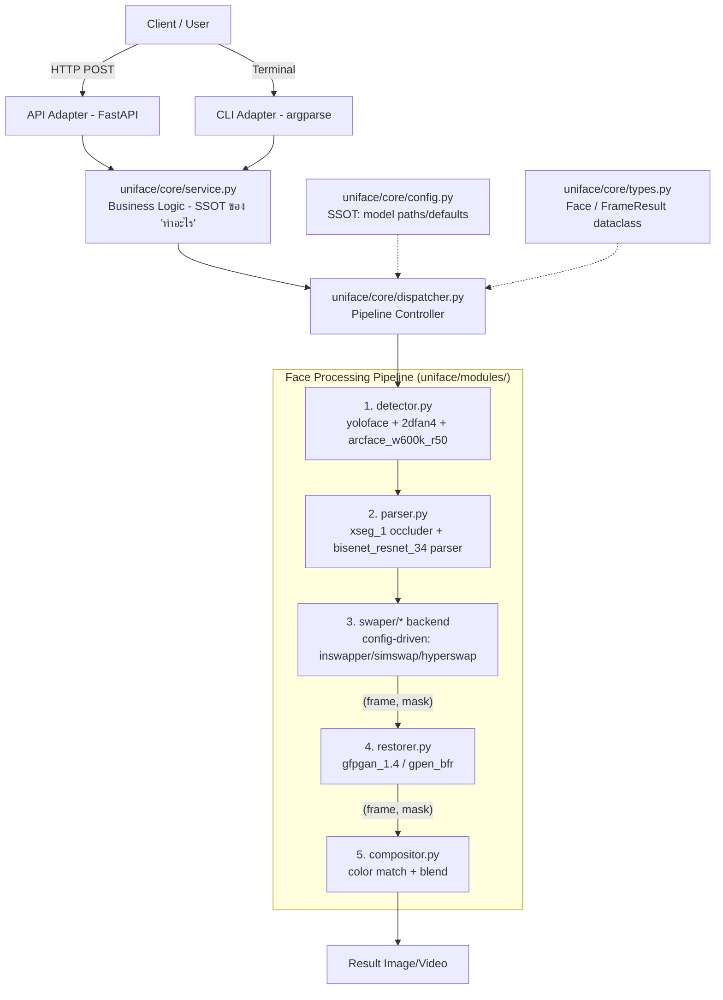

# PIPELINE.md — uni-face

รายงานกลาง (Central Report) ของ pipeline + สถานะโมดูล อ้างอิงโครงสร้างจาก facefusion (detection → landmark → recognition → manipulation → paste-back) แต่ **implement เอง ใช้ asset จริงที่มี** ห้าม copy logic จาก facefusion เข้ามาปนใน core ตรงๆ (license OpenRAIL-AS มีเงื่อนไข) — โค้ด facefusion ที่ดึงมาใช้ต้องอยู่หลัง adapter เท่านั้น (ดู AGENT.md > External/Vendor Integration)

## 1. System Pipeline Diagram

**หมายเหตุสำคัญ:**
- Swaper/Restorer คืนค่ารูปแบบเดียวกันเสมอ `(frame, mask)` → เพิ่ม processor ใหม่เสียบเข้า pipeline ได้โดยไม่แก้ dispatcher
- `Face` dataclass กำหนดที่เดียวใน `uniface/core/types.py` ใช้ร่วมทุก stage ห้ามแต่ละ module สร้าง schema เอง

## 2. Data Contract ต่อ stage

| # | Stage | Module | Input | Output |
|---|-------|--------|-------|--------|
| 0 | Frame extraction | `uniface/modules/io/video_io.py` | video path | `List[frame:ndarray]` (image = 1 frame) |
| 1 | Detect+Landmark+Recognize | `uniface/modules/detector.py` | `frame` | `List[Face]` = `{bbox, landmark_5/106, embedding, gender_age}` |
| 2 | Face select | `uniface/core/service.py` | `List[Face]` + criteria | `Face` (target) |
| 3 | Masking | `uniface/modules/parser.py` | `frame` + `Face` | `mask:ndarray (H,W,1)` |
| 4 | Swap | `uniface/modules/swaper/<backend>.py` | `source_embedding` + `frame` + `Face` | `(frame, mask)` |
| 5 | Restore (optional) | `uniface/modules/restorer.py` | `(frame, mask)` | `(frame, mask)` |
| 6 | Composite | `uniface/modules/compositor.py` | `(frame, mask)` + original frame | `frame` (final) |
| 7 | Output creation | `uniface/modules/io/*.py` | `List[frame]` | image/video file |

## 3. Model Mapping (ใช้ default model set ของ facefusion — กำลังจะโหลดมาเพิ่ม)

| Stage | facefusion default model | Argument อ้างอิง | หมายเหตุ |
|-------|---------------------------|-------------------|---------|
| Face Detector | `yoloface` (yoloface_8n.onnx) | `--face-detector-model` (choices: yoloface, retinaface, scrfd, many) | ตัวหาบ bbox เบื้องต้น |
| Face Landmarker | `2dfan4` | `--face-landmarker-model` (choices: 2dfan4, peppa_wutz) | หา landmark ละเอียด (68 จุด) |
| Face Recognizer | `arcface_w600k_r50` | ผูกกับ swapper model | **ตรงกับที่มีอยู่แล้ว** `insightface_models/models/buffalo_l/w600k_r50.onnx` |
| Face Occluder (mask) | `xseg_1` | `--face-occluder-model` (choices: xseg_1/2/3, many) | มือ/ผม/สิ่งบังหน้า |
| Face Parser (mask) | `bisenet_resnet_34` | `--face-parser-model` (choices: bisenet_resnet_18/34) | region mask (ตา/ปาก/ฯลฯ) — แทน Segformer เดิม |
| Face Swapper | `inswapper_128` (default) | `--face-swapper-model` (choices: inswapper_128, inswapper_128_fp16, simswap_256, simswap_512_unofficial, blendswap_256, uniface_256, hyperswap_1a/1b/1c_256) | **config-driven** เลือกได้ตอนรัน ของเดิมที่มีอยู่แล้วใช้ต่อได้ (inswapper_128, simswap_256/512, hyperswap_1a/1b/1c) |
| Face Enhancer (restore) | `gfpgan_1.4` (default) | `--face-enhancer-model` (choices: codeformer, gfpgan_1.2/1.3/1.4, gpen_bfr_256/512/1024/2048, restoreformer_plus_plus) | ของเดิม GFPGANv1.4, GPEN-BFR-512/1024 ใช้ต่อได้ เพิ่ม codeformer ได้ถ้าโหลดมา |
| Video I/O | ffmpeg | — | มีอยู่แล้ว `models/ffmpeg.exe` |

**การดาวน์โหลดโมเดล:** ปัจจุบันระบบมีตัวจัดการโมเดลอัตโนมัติแล้ว สามารถดาวน์โหลดและตรวจสอบความสมบูรณ์ของไฟล์ (.hash) ได้โดยรันคำสั่ง `python uni-face.py models install`

## 4. สถานะโมดูล

| Module | Path | สถานะ | หมายเหตุ |
|--------|------|-------|---------| 
| Config (SSOT paths) | `uniface/core/config.py` | 🟢 done | |
| Types (Face, FrameResult) | `uniface/core/types.py` | 🟢 done | |
| State | `uniface/core/state.py` | 🟢 done | ini + argparse; global singleton (safe with 1 worker thread) |
| Service | `uniface/core/service.py` | 🟢 done | business logic layer; detect/swap/restore/color |
| Image Service | `uniface/core/image_service.py` | 🟢 done | batch image processing via SwarmEngine |
| Video Service | `uniface/core/video_service.py` | 🟢 done | ffmpeg extract → swarm → merge; resume support |
| SwarmEngine | `uniface/core/swarm.py` | 🟢 done | parallel pipeline with dynamic backpressure tuner |
| Face Model | `uniface/core/face_model.py` | 🟢 done | safetensors save/load for multi-image face embedding |
| Dispatcher | `uniface/core/dispatcher.py` | 🟡 stub | placeholder only — real flow lives in service.py |
| Detector | `uniface/modules/detector.py` | 🟢 done | yoloface+2dfan4+arcface (adapter, ไม่ copy logic facefusion) |
| Parser (mask) | `uniface/modules/parser.py` | 🟢 done | xseg_1 (occluder) + bisenet_resnet_34 (region) + box + eyes |
| Compositor | `uniface/modules/compositor.py` | 🟢 done | multi-scale color match + seamless blend |
| Swaper base (interface) | `uniface/modules/swaper/base.py` | 🟢 done | abstract: load(), swap() |
| Swaper: inswapper | `uniface/modules/swaper/inswapper.py` | 🟢 done | affine transform + onnx session |
| Swaper: hyperswap | `uniface/modules/swaper/hyperswap.py` | 🟡 in_progress | skeleton exists |
| Swaper: simswap | `uniface/modules/swaper/simswap.py` | 🔴 not_started | |
| Restorer | `uniface/modules/restorer.py` | 🟢 done | GFPGAN/GPEN/CodeFormer, รับ-คืน (frame,mask) |
| Image IO | `uniface/modules/io/image_io.py` | 🟡 stub | minimal placeholder |
| Video IO (ffmpeg) | `uniface/modules/io/video_io.py` | 🟡 stub | minimal placeholder; real logic in uniface/core/video_service.py |
| CLI adapter | `uniface/cli/adapter.py` | 🟢 done | argparse → service |
| API adapter | `uniface/api/adapter.py` | 🟢 done | FastAPI → service |
| API Server | `uniface/api_server.py` | 🟢 done | FastAPI + WebSocket + JobManager; jobs.json persistence |
| main.py | `uniface/main.py` | 🟢 done | subcommand: cli / serve |
| Tests | `tests/test_fixes.py` | 🟢 done | unit tests for code-review fixes |
| Tests (full suite) | `tests/` | 🔴 not_started | mock onnxruntime, คู่ทุก module |

สถานะ: 🔴 not_started → 🟡 in_progress/stub → 🟢 done → ✅ tested
**กติกา:** อัปเดตสถานะทันทีที่โมดูลเสร็จ+เทสผ่าน ห้ามข้ามไปโมดูลที่ dependency ยังไม่ 🟢/✅

## 5. Next Steps (MVP1: swap ภาพนิ่ง ไม่ปรับสี/ไม่ restore)
1. `uniface/core/types.py` + `uniface/core/config.py` — วาง data contract ให้นิ่งก่อน
2. `uniface/modules/detector.py` — insightface adapter
3. `uniface/modules/swaper/base.py` + `inswapper.py` — 1 backend ให้รันจบ pipeline ได้ก่อน
4. `uniface/core/dispatcher.py` — ต่อ detector → swaper → output แบบไม่มี mask/restore
5. Unit test คู่ทุกไฟล์ที่ทำ ก่อนไปโมดูลถัดไป
6. ค่อยเพิ่ม parser/restorer/compositor/backend อื่นๆ + CLI/API adapter
